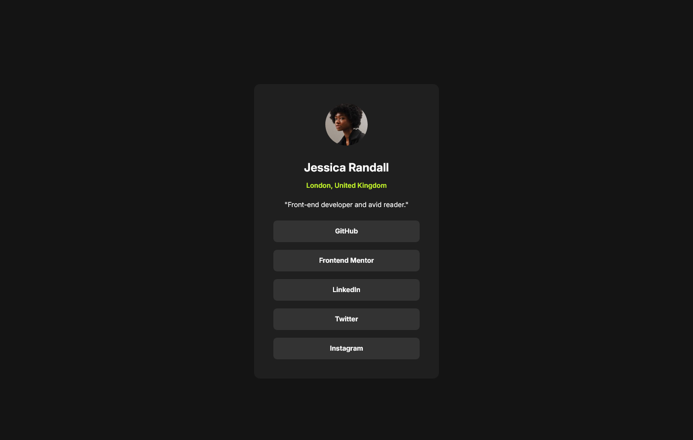

# Frontend Mentor - Social links profile solution

This is a solution to the [Social links profile challenge on Frontend Mentor](https://www.frontendmentor.io/challenges/social-links-profile-UG32l9m6dQ). Frontend Mentor challenges help you improve your coding skills by building realistic projects. 

## Table of contents

- [Overview](#overview)
  - [The challenge](#the-challenge)
  - [Screenshot](#screenshot)
  - [Links](#links)
- [My process](#my-process)
  - [Built with](#built-with)
  - [What I learned](#what-i-learned)
  - [Continued development](#continued-development)
  - [Useful resources](#useful-resources)
- [Author](#author)


## Overview

### The challenge

Users should be able to:

- See hover and focus states for all interactive elements on the page

### Screenshot



### Links

- Solution URL: [@FrontendMentor.io](https://www.frontendmentor.io/solutions/social-link-profile-card-solution-PH2u-ByHsu)
- Live Site URL: [@Vercel](https://frontendmentor-social-links-profile-five.vercel.app/)

## My process

### Built with

- Semantic HTML5 markup
- CSS custom properties
- Flexbox
- CSS Grid
- Mobile-first workflow

### What I learned

To see how you can add code snippets, see below:

```html
 <body>
    <main>
      <social-link-profile></social-link-profile>
    </main>
    <template id="social-link-profile-template">
      <div class="card">
        
        <div class="name-location-bio">
          <h1 class="name">Jessica Randall</h1>
          <p class="location">London, United Kingdom</p>
          <p class="bio">"Front-end developer and avid reader."</p>
        </div>
        <div class="social-networks-links">
          <div class="button">GitHub</div>
          <div class="button">Frontend Mentor</div>
          <div class="button">LinkedIn</div>
          <div class="button">Twitter</div>
          <div class="button">Instagram</div>
        </div>
      </div>
    </template>
  </body>
```
```css
@media screen and (max-width: 376px) {
  .card {
    max-width: 327px;
    max-height: 579px;
    margin: 0 auto;
    margin-top: 116.5px;
    padding-top: 24px;
    padding-bottom: 24px;
  }
  .social-networks-links .button {
    margin-left: 24px;
    margin-right: 24px;
  }
}
```
```js
export class SocialLinkProfile extends HTMLElement {
  constructor() {
    super();
    const template = document.getElementById("social-link-profile-template");
    const content = template.content.cloneNode(true);
    const styles = document.createElement("style");

    this.root = this.attachShadow({ mode: "open" });
    this.root.appendChild(content);
    this.root.appendChild(styles);

    async function loadCSS() {
      const request = await fetch("/components/SocialLinkProfile.css");
      const css = await request.text();
      styles.textContent = css;
    }

    loadCSS();
  }
}

customElements.define("social-link-profile", SocialLinkProfile);
```

### Continued development


### Useful resources

## Author

- Website - [Gustavo Sanchez](https://gusanchefullstack.dev/)
- Frontend Mentor - [@gusanchefullstack](https://www.frontendmentor.io/profile/gusanchefullstack)
- Twitter - [@gusanchedev](https://twitter.com/gusanchedev)